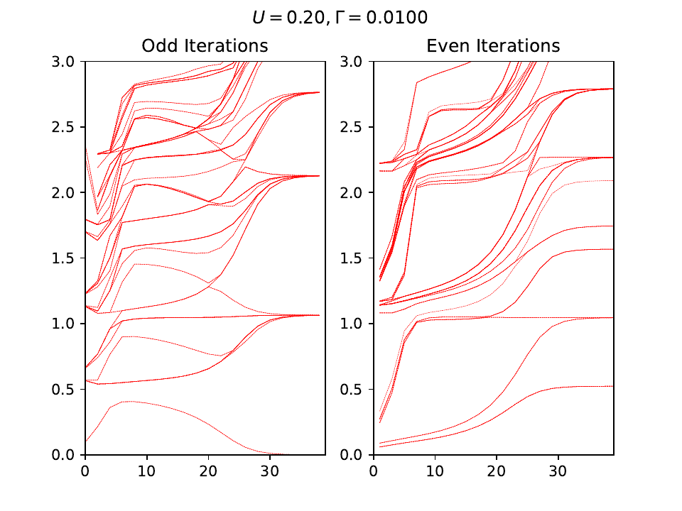

# nrgplusplus

[](https://github.com/srbhp/nrgplusplus/actions/workflows/cmake.yml)

`nrgplusplus` is a modern C++ implementation of the 
Numerical Renormalization Group (NRG) method, designed to solve quantum impurity problems embedded in a bath. 
This implementation adheres to the conventions outlined in 
[Bulla, 2008](https://doi.org/10.1103/RevModPhys.80.395).

## Documentation
Comprehensive documentation is available at:  
https://srbhp.github.io/nrgplusplus/

### Quick Start Guide
For a quick setup and build instructions, refer to:  
https://srbhp.github.io/nrgplusplus/build.html

## Example: Single Impurity Anderson Model (SIAM)
`(See: examples/rgflowSIAM/main.cpp)`

Define the impurity model with onsite energy `eps` and Coulomb energy `U_int`:

```cpp
spinhalf impurity(eps, U_int);
```

The bath for the SIAM is constructed similarly:

```cpp
spinhalf bathModel(0, 0); // set parameters
```

Once the impurity and bath are defined, construct an `nrgcore` object to handle the NRG iterations. This includes calculating static and dynamic quantities of the impurity:

```cpp
nrgcore<spinhalf, spinhalf> siam(impurity, bathModel);
siam.set_parameters(1024);       // set max number of states to be kept
siam.add_bath_site({V, V}, 1.0); // V is the coupling between the impurity and the first bath site
siam.update_internal_state();
```

Next, iteratively add bath sites and save eigenvalues to an HDF5 file:

```cpp
// File where output will be written
h5stream::h5stream rfile("resultSIAM.h5");

// Iteratively add bath sites
for (int in = 0; in < nMax; in++) {
  double rescale = 1.0;
  if (in > 0) {
    rescale = std::sqrt(LAMBDA);
  }
  siam.add_bath_site({hopping(in, LAMBDA), hopping(in, LAMBDA)}, rescale);
  // Update system operators here if needed before updating the internal state
  siam.update_internal_state();
  // Save the eigenvalues of the current iteration
  rfile.write(siam.all_eigenvalue, "Eigenvalues" + std::to_string(in));
}
rfile.close();
```

Plot the RG flow `(See: examples/rgflowSIAM/plot.py)`:  


## Contributing

Contributions are welcome! For major changes, please open an issue first to discuss your ideas.  
Ensure that tests are updated as appropriate.

## Similar Open-source Projects

1. http://www.phy.bme.hu/~dmnrg/
2. https://github.com/rokzitko/nrgljubljana

## Acknowledgment

This project was developed with the support of:  
- Prof. Jonas Fransson, Uppsala University  
- Prof. Frithjof Anders, Technical University Dortmund  

Their guidance and support were instrumental in making this project possible.
