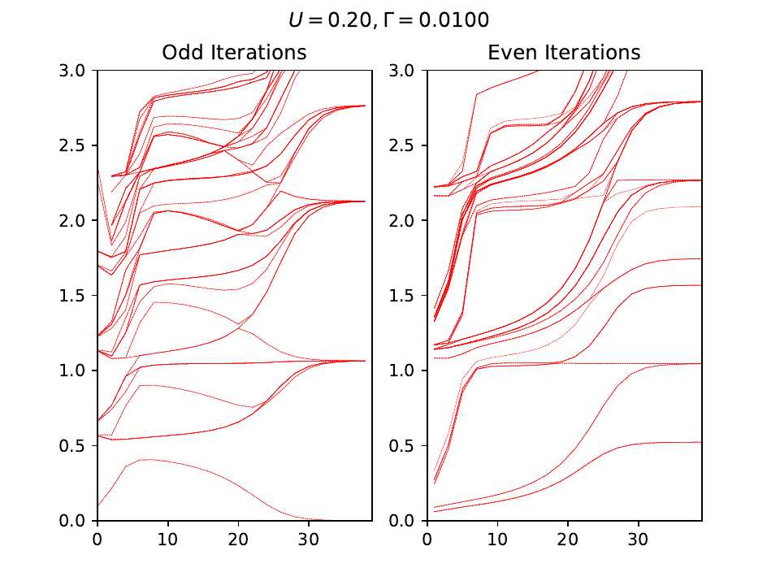

=========================================================
nrgplusplus
=========================================================

The numerical renormalization group (NRG) method is a powerful
technique for investigating the low-energy properties of strongly
correlated electronic systems. It has found widespread applications
in condensed matter physics, including the study of quantum impurity
models and the Kondo effect. In order to facilitate the implementation
of the NRG method, several software packages have been developed, each
with its own strengths and limitations.

`nrgplusplus` is  implementation of the NRG method is written in the
Modern C++ programming language. This package provides a versatile and
efficient framework for performing NRG calculations. The C++ language 
is well-suited to numerical calculations, and the package has been 
designed with efficiency and speed in mind.

.. image:: ../docs/image/outline.svg
   :width: 100%
   :alt: Outline of the nrgplusplus library

The ``nrgcore`` is the main class which handles all NRG sub-tasks. 
``nrgcore`` takes two class as a template argument 
for the Impurity model and the bath model. The bath model
is a class that describes bath. The impurity model is a class
that describes the impurity. In some cases the impurity class 
model is also include the first Wilson site.

Each Model (bath or impurity) class  should have
these member vairables:

  
  * std::vector<qOperator> f_dag_operator
  * std::vector<std::vector<double>> eigenvalues_Q
  * std::vector<double> chi_Q
  * std::vector<std::vector<int>> n_Q

Example : Single Impurity Anderson Impurity (SIAM)
---------------------------------------------------
`(See : examples/rgflowSIAM/main.cpp)`

A overview of the SIAM model can be found here `Bulla, 2008 <https://doi.org/10.1103/RevModPhys.80.395>  `_ .
Define the impurity Model wth onsite energy `eps` and Coulomb energy `U_int`. 

.. code-block:: cpp

  spinhalf impurity(eps, U_int);

The bath for the SIAM is also constructed in the same way. 

.. code-block:: cpp

  spinhalf bathModel(0, 0); // set parameters

Once we have created the bath and the impurity we can 
construct a `nrgcore` object which will take care of 
many things that we need to do for the `NRG iterations`.
This includes calculating static and dynamic quantities
of the Impurity.

.. code-block:: cpp

  nrgcore<spinhalf, spinhalf> siam(impurity, bathModel);
  siam.set_parameters(1024);       // set max number of states to be kept
  siam.add_bath_site({V, V}, 1.0); // V is the coupling og the impurity and first bath site. 
  siam.update_internal_state();

Next we iteratively add the bath sites in the same way. We 
also create HDF5 file object to save the Eigenvalues.

.. code-block:: cpp

  // file where outputput will be wriiten
  h5stream::h5stream rfile("resultSIAM.h5");
  // Iterative add bath sites
  for (int in = 0; in < nMax; in++) {
    double rescale = 1.0;
    if (in > 0) {
      rescale = std::sqrt(LAMBDA);
    }
    siam.add_bath_site({hopping(in, LAMBDA), hopping(in, LAMBDA)}, rescale);
    // Update System Operators now here if we need to.
    // This has to be done before updating the systems internal state.
    siam.update_internal_state();
    // Save the eigenvalue of the current iteration
    rfile.write(siam.all_eigenvalue, "Eigenvalues" + std::to_string(in));
  }
  rfile.close();

Plot the RG flow `(See : examples/rgflowSIAM/plot.py)`.

Docs
====

.. toctree::
  :maxdepth: 2
  :caption: Contents:

  api/library_root
  build
  docnrgcore
  docspinhalf
  docfermionBasis
  docqoperator
  docsysopr
  docnrgdata
  docfdmback
  docfdmspec
  doch5stream

Indices and tables
==================

* :ref:`genindex`
* :ref:`modindex`
* :ref:`search` 

