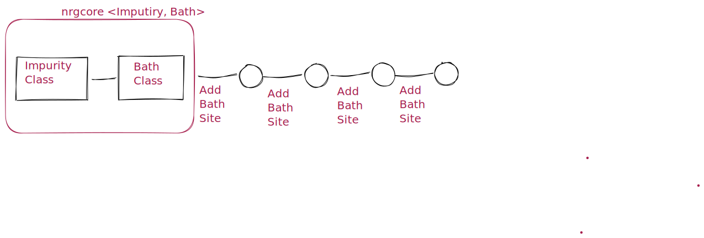

nrgplusplus
=========================================================

The numerical renormalization group (NRG) method is a powerful
technique for investigating the low-energy properties of strongly
correlated electronic systems. It has found widespread applications
in condensed matter physics, including the study of quantum impurity
models and the Kondo effect. In order to facilitate the implementation
of the NRG method, several software packages have been developed, each
with its own strengths and limitations.

`nrgplusplus` is  implementation of the NRG method is written in the
Modern C++ programming language. This package provides a versatile and
efficient framework for performing NRG calculations. The C++ language 
is well-suited to numerical calculations, and the package has been 
designed with efficiency and speed in mind.

``nrgcore`` takes two class as a template argument 
for the Impurity model and the bath model. The bath model
is a class that describes bath. The impurity model is a class
that describes the impurity. In some cases the impurity class 
model is also include the first Wilson site.

Docs
====

.. toctree::
  :maxdepth: 2
  :caption: Contents:

  build
  docnrgcore
  docspinhalf
  docfermionBasis
  docqoperator
  docsysopr
  docnrgdata
  docfdmback
  docfdmspec
  doch5stream

Indices and tables
==================

* :ref:`genindex`
* :ref:`modindex`
* :ref:`search` 

