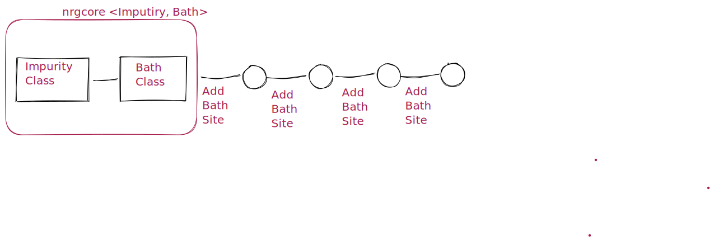
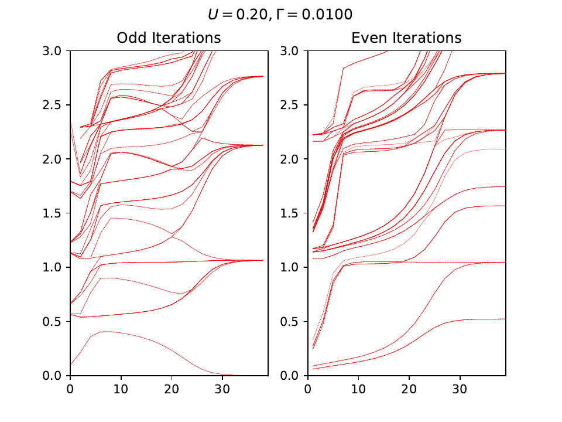

=========================================================
nrgplusplus
=========================================================

**Efficient Numerical Renormalization Group (NRG) calculations in Modern C++**

``nrgplusplus`` is a high-performance C++ library for solving quantum impurity problems 
using the Numerical Renormalization Group method. It is designed for studying strongly 
correlated electron systems including:

- **Kondo effect** and quantum impurities
- **Single Impurity Anderson Model (SIAM)**
- **Multi-channel and multi-impurity systems**
- **Magnetic impurities in superconductors, Yu-Shiba-Rusinov states**

The library provides a modular, template-based architecture that is both flexible for 
model development and optimized for computational speed using Intel MKL.

Architecture Overview
---------------------

**Core Components:**

- **nrgcore**: Main NRG solver class that manages iterations
- **Impurity models**: Define the quantum impurity (e.g., Anderson model, Kondo model)
- **Bath models**: Define the environment or conduction band
- **Symmetries**: Block-diagonalize by conserved quantum numbers (charge, spin, etc.)

Every impurity or bath model must provide:

  * ``std::vector<qOperator> f_dag_operator`` — Fermionic creation operators
  * ``std::vector<std::vector<double>> eigenvalues_Q`` — Eigenvalues per quantum number sector
  * ``std::vector<double> chi_Q`` — Fermion signs (parity)
  * ``std::vector<std::vector<int>> n_Q`` — Quantum numbers labeling each sector

Quick Start Example: Single Impurity Anderson Model (SIAM)
----------------------------------------------------------

**Reference**: `Bulla et al., Rev. Mod. Phys. 80, 395 (2008) <https://doi.org/10.1103/RevModPhys.80.395>`_

**1. Define the impurity and bath models:**

.. code-block:: cpp

  // Impurity: single orbital with onsite energy and Hubbard U
  spinhalf impurity(eps=-1.0, U_int=2.0);
  
  // Bath: non-interacting conduction electrons
  spinhalf bathModel(eps=0, U_int=0);

**2. Create the NRG solver and configure:**

.. code-block:: cpp

  nrgcore<spinhalf, spinhalf> siam(impurity, bathModel);
  siam.set_parameters(1024);  // Keep up to 1024 states per iteration

**3. Run NRG iterations:**

.. code-block:: cpp

  h5stream::h5stream results("siam_output.h5");  // Save results to HDF5
  
  double Lambda = 2.0;  // RG flow parameter
  for (int iteration = 0; iteration < nMax; iteration++) {
    double V = 0.5;  // Impurity-bath coupling
    double rescale = (iteration > 0) ? std::sqrt(Lambda) : 1.0;
    
    siam.add_bath_site({V, V}, rescale);
    siam.update_internal_state();
    
    results.write(siam.all_eigenvalue, "iteration" + std::to_string(iteration));
  }
  results.close();

**4. Visualize results:**

Plot RG flow (see `examples/rgflowSIAM/plot.py`)

Docs
====

.. toctree::
  :maxdepth: 2
  :caption: Contents:

  api/library_root
  build
  docnrgcore
  docspinhalf
  docfermionBasis
  docqoperator
  docsysopr
  docnrgdata
  docfdmback
  docfdmspec
  doch5stream

Indices and tables
==================

* :ref:`genindex`
* :ref:`modindex`
* :ref:`search` 

