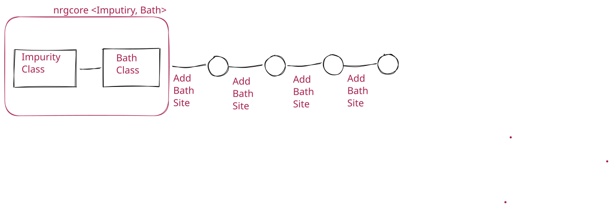
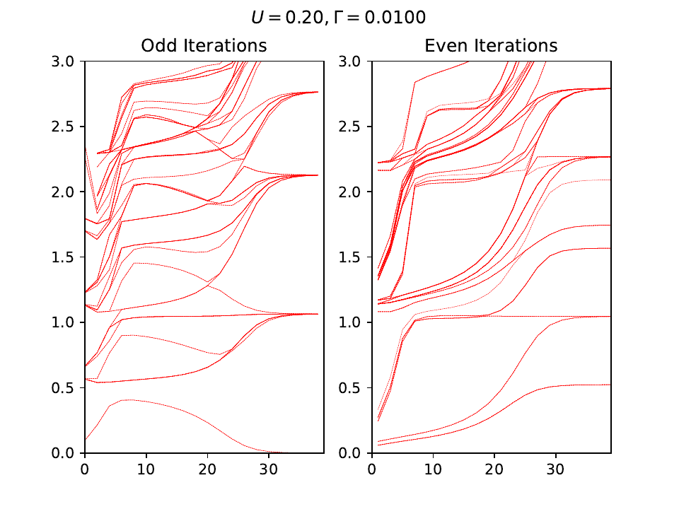

=========================================================
nrgplusplus
=========================================================

**Efficient Numerical Renormalization Group (NRG) calculations in Modern C++**

``nrgplusplus`` is a high-performance C++ library for solving quantum impurity problems 
using the Numerical Renormalization Group method. It provides comprehensive tools for studying strongly 
correlated electron systems with flexible model definitions and optimized numerical performance.

**Supported Systems:**

- **Kondo effect** and quantum impurities  
- **Single Impurity Anderson Model (SIAM)** — a fundamental model in condensed matter physics
- **Multi-channel and multi-impurity systems** — complex many-body problems
- **Superconducting proximity effects** — magnetic impurities in superconductors, Yu-Shiba-Rusinov states
- **Free particles and resonant levels** — non-interacting reference systems
- **Custom models** — fully extensible architecture for user-defined Hamiltonians

**Key Capabilities:**

- Dynamic spectral functions and correlation functions via Full Density Matrix NRG (FDM-NRG)
- Temperature-dependent thermodynamic quantities (entropy, susceptibility, specific heat)
- Flexible quantum number symmetries and block-diagonalization
- Native HDF5 data persistence for large-scale computations
- Modern C++20 design with efficient memory management
- BLAS/LAPACK optimization for linear algebra operations

Architecture Overview
---------------------

**Core Components:**

- **nrgcore**: Main NRG solver class that manages iterations
- **Impurity models**: Define the quantum impurity (e.g., Anderson model, Kondo model)
- **Bath models**: Define the environment or conduction band
- **Symmetries**: Block-diagonalize by conserved quantum numbers (charge, spin, etc.)

Every impurity or bath model must provide:

  * ``std::vector<qOperator> f_dag_operator`` — Fermionic creation operators
  * ``std::vector<std::vector<double>> eigenvalues_Q`` — Eigenvalues per quantum number sector
  * ``std::vector<double> chi_Q`` — Fermion signs (parity)
  * ``std::vector<std::vector<int>> n_Q`` — Quantum numbers labeling each sector

Available Models and Examples
------------------------------

The library includes 10 complete, working examples covering a range of physical systems:

**Renormalization Group Flow:**

- **rgflowSIAM** — RG flow evolution for the Single Impurity Anderson Model
- **rgflowKondo** — RG flow analysis of the Kondo effect with spin-flip scattering

**Thermodynamic Properties:**

- **entropySIAM** — Temperature-dependent entropy for Anderson impurities
- **entropyKondo** — Temperature evolution in Kondo systems

**Spectral and Dynamic Properties:**

- **fdmSpectrumSiam** — Spectral function via Frequency Domain Mode for SIAM
- **fdmSpectrumTwoChannel** — Multi-channel system spectral properties

**Specialized Systems:**

- **resonantLevel** — Non-interacting resonant level model
- **twoChannelSiam** — Multi-channel Anderson impurity system
- **rabiAnderson** — Rabi oscillations coupled to Anderson impurity
- **freeModel** — Free fermion model for testing and validation

Each example includes C++ source, CMake configuration, Python analysis scripts, and sample outputs. 
See the `API Documentation <api/library_root.html>`_ for detailed class references and the 
`Build Guide <build.html>`_ for compilation instructions.

Quick Start Example: Single Impurity Anderson Model (SIAM)
----------------------------------------------------------

**Reference**: `Bulla et al., Rev. Mod. Phys. 80, 395 (2008) <https://doi.org/10.1103/RevModPhys.80.395>`_

**1. Define the impurity and bath models:**

.. code-block:: cpp

  // Impurity: single orbital with onsite energy and Hubbard U
  spinhalf impurity(eps=-1.0, U_int=2.0);
  
  // Bath: non-interacting conduction electrons
  spinhalf bathModel(eps=0, U_int=0);

**2. Create the NRG solver and configure:**

.. code-block:: cpp

  nrgcore<spinhalf, spinhalf> siam(impurity, bathModel);
  siam.set_parameters(1024);  // Keep up to 1024 states per iteration

**3. Run NRG iterations:**

.. code-block:: cpp

  h5stream::h5stream results("siam_output.h5");  // Save results to HDF5
  
  double Lambda = 2.0;  // RG flow parameter
  for (int iteration = 0; iteration < nMax; iteration++) {
    double V = 0.5;  // Impurity-bath coupling
    double rescale = (iteration > 0) ? std::sqrt(Lambda) : 1.0;
    
    siam.add_bath_site({V, V}, rescale);
    siam.update_internal_state();
    
    results.write(siam.all_eigenvalue, "iteration" + std::to_string(iteration));
  }
  results.close();

**4. Visualize results:**

Plot RG flow (see `examples/rgflowSIAM/plot.py`)

Theory and References
---------------------

This implementation follows the Numerical Renormalization Group method as described in the seminal review:

**Bulla, R., Costi, T. A., & Pruschke, T. (2008).**  
*The Numerical Renormalization Group Method for Quantum Impurity Systems.*  
**Reviews of Modern Physics**, 80(2), 395–450.  
`https://doi.org/10.1103/RevModPhys.80.395 <https://doi.org/10.1103/RevModPhys.80.395>`_

The method is particularly suited for:
- Computing ground state and thermal properties
- Calculating spectral functions and response functions
- Studying universal properties in quantum impurity physics
- Analyzing scaling behavior near quantum critical points

System Requirements
-------------------

**Compiler & Build:**

- C++20 compatible compiler (GCC 10+, Clang 12+, or equivalent)
- CMake 3.11 or later

**Libraries:**

- BLAS (Basic Linear Algebra Subprograms)
- LAPACK (Linear Algebra Package)
- LAPACKE (C interface to LAPACK)
- HDF5 (for data I/O)

**Optional:**

- Python 3.11+ (for visualization and analysis scripts)
- Sphinx (for building documentation)

See the `Build Guide <build.html>`_ for detailed installation instructions for your system.

Getting Started
===============

New to ``nrgplusplus``? Here's how to get started:

1. **Installation & Build** — `Build Guide <build.html>`_
2. **Quick Examples** — Run the working examples in ``examples/``
3. **API Reference** — Detailed class and function documentation below

Complete Documentation
======================

.. toctree::
  :maxdepth: 2
  :caption: Installation & Setup:

  build

.. toctree::
  :maxdepth: 2
  :caption: Core Library:

  docnrgcore
  docnrgdata

.. toctree::
  :maxdepth: 2
  :caption: Impurity Models:

  docspinhalf
  docfermionBasis

.. toctree::
  :maxdepth: 2
  :caption: Quantum Operators & Symmetries:

  docqoperator
  docsysopr

.. toctree::
  :maxdepth: 2
  :caption: Dynamics & Spectroscopy:

  docfdmback
  docfdmSpectrum

.. toctree::
  :maxdepth: 2
  :caption: Examples:

  examples

.. toctree::
  :maxdepth: 2
  :caption: Utilities & I/O:

  doch5stream

.. toctree::
  :maxdepth: 3
  :caption: Full API Reference:

  api/library_root

Indices and tables
==================

* :ref:`genindex`
* :ref:`modindex`
* :ref:`search` 

